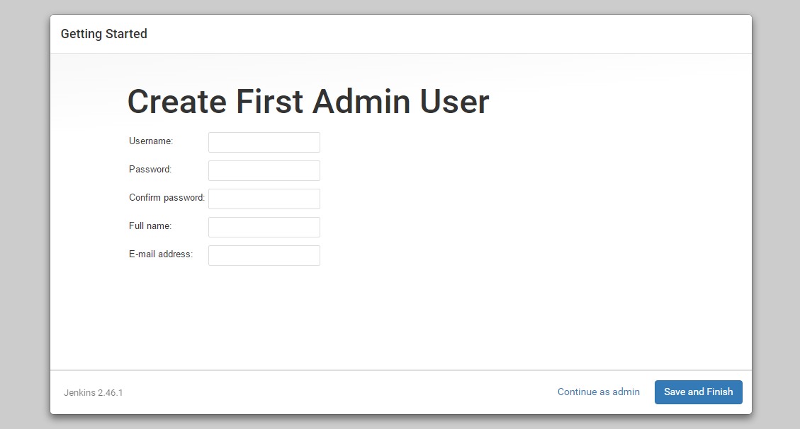
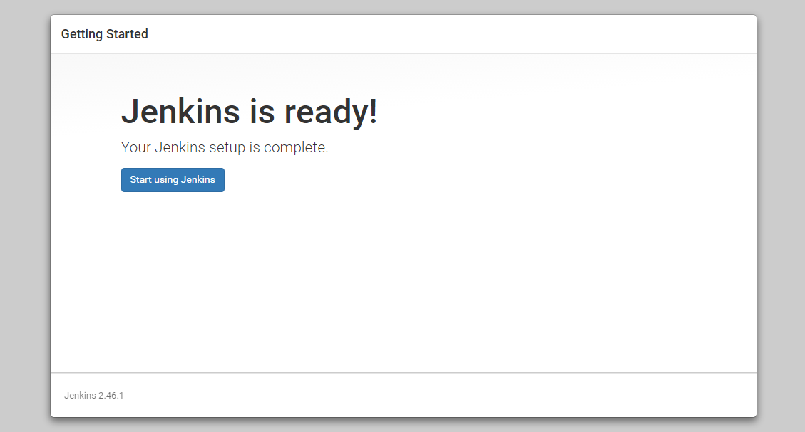
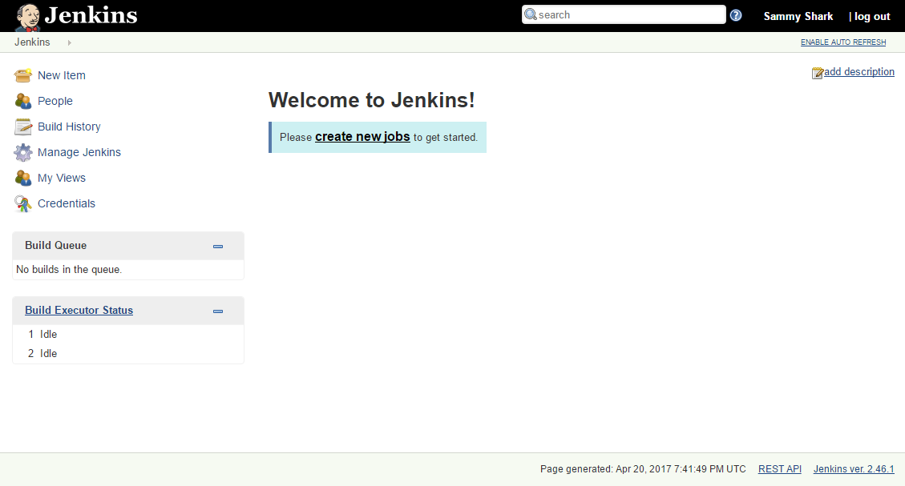

# Capability-project
---

# Table of Content
* [Required softwares](#required_softwares)
* [Software Installation](#software_installation)
* [Using the application](#using-application)


## <a name="required_s oftwares"></a>Required softwares
* [STS](https://spring.io/tools)
* [Jenkins](https://jenkins.io/)
* [GitHub](https://github.com/)
* [Sonarqube](https://www.sonarqube.org/)
* [PostgreSQL](https://www.postgresql.org/)
* [Docker](https://www.docker.com/)
* [Kubernetes](https://kubernetes.io/)
* [Elasticsearch](https://www.elastic.co/products/elasticsearch)
* [Kafka](https://kafka.apache.org/)
* [Logstash](https://www.elastic.co/products/logstash)
* [Kibana](https://www.elastic.co/products/kibana)
---

## <a name="software_installation"></a>Software Installation

<details>
  
<summary>Jenkins Installation</summary>

 **Step 1 — Installing Jenkins**

* First, we'll add the repository key to the system.
  ```
  $ wget -q -O - https://pkg.jenkins.io/debian/jenkins-ci.org.key | sudo apt-key add -
  ```
* When the key is added, the system will return OK. Next, we'll append the Debian package repository address to the server's sources.list:
  ```
  $ echo deb https://pkg.jenkins.io/debian-stable binary/ | sudo tee /etc/apt/sources.list.d/jenkins.list
  ```
* When both of these are in place, we'll run update so that apt-get will use the new repository:
  ```
  $ sudo apt-get update
  ```
* Finally, we'll install Jenkins and its dependencies, including Java:
  ```
  $ sudo apt-get install jenkins
  ```
 **Step 2 — Starting Jenkins**

* Now that Jenkins and its dependencies are in place, we'll start the Jenkins server.
  ```
  $ sudo systemctl start jenkins
  ```
* Since systemctl doesn't display output, we'll use its status command to verify that it started successfully:
  ```
  $ sudo systemctl status jenkins
  ```
* If everything went well, the beginning of the output should show that the service is active and configured to start at boot:
  ```
  Output
  ● jenkins.service - LSB: Start Jenkins at boot time
  Loaded: loaded (/etc/init.d/jenkins; bad; vendor preset: enabled)
  Active:active (exited) since Thu 2017-04-20 16:51:13 UTC; 2min 7s ago
    Docs: man:systemd-sysv-generator(8)
  ```
 **Step 3 — Opening the Firewall**  
* By default, Jenkins runs on port 8080, so we'll open that port using ufw:
  ```
  $ sudo ufw allow 8080
  ```
* We can see the new rules by checking UFW's status.
  ```
  $ sudo ufw status
  ```
* We should see that traffic is allowed to port 8080 from anywhere:
  ```
  Output
  Status: active

  To                         Action      From
  --                         ------      ----
  OpenSSH                    ALLOW       Anywhere
  8080                       ALLOW       Anywhere
  OpenSSH (v6)               ALLOW       Anywhere (v6)
  8080 (v6)                  ALLOW       Anywhere (v6)
  ```
* Note: If the firewall is inactive, the following commands will make sure that OpenSSH is allowed and then enable it.
  ```
  $ sudo ufw allow OpenSSH
  $ sudo ufw enable
  ```
 **Step 4 — Setting up Jenkins**
* To set up our installation, we'll visit Jenkins on its default port, 8080, using the server domain name or IP address: http://ip_address_or_domain_name:8080

* We should see "Unlock Jenkins" screen, which displays the location of the initial password

* In the terminal window, we'll use the cat command to display the password:
  ```
  $ sudo cat /var/lib/jenkins/secrets/initialAdminPassword
  ```
* We'll copy the 32-character alphanumeric password from the terminal and paste it into the "Administrator password" field, then click "Continue". The next screen presents the option of installing suggested plugins or selecting specific plugins.

* We'll click the "Install suggested plugins" option, which will immediately begin the installation process.

* When the installation is complete, we'll be prompted to set up the first administrative user. It's possible to skip this step and continue as admin using the initial password we used above, but we'll take a moment to create the user.

* Once the first admin user is in place, you should see a "Jenkins is ready!" confirmation screen.

* Click start using jenkins to visit the main Jenkins dashboard.


* At this point, Jenkins has been successfully installed.
</details>

<details>
<summary>Github</summary>

* Create account on github so that you can store your code in online repository.
</details>

<details>
<summary>PostgreSQL Installation</summary>
  
* Before proceeding with installation of any kind of package, use the following command to update your Ubuntu system. To execute this command, remember to login from non-root user with sudo privileges. 
  ```
  $ sudo apt-get update
  ```
* Now install postgresql using this command.
  ```
  $ sudo apt-get install postgresql postgresql-contrib
  ```
  **Using postgresql**
  
* Start the postgresql service by using folowing command:
  ```
  $ sudo service postgresql start
  ```
* locate pg_hba.conf file in your system using command:
  ```
  $ locate pg_hba.conf
  ```
* add following line in _IPV4 local connection_ of pg_hba.conf file so that docker image can be connected to your local databse.
  ```
  host    all   	        all             <ip address of your machine>/32         md5
  ```
* Switch over to the postgres account on your server by typing:
  ```
  $ sudo -i -u postgres
  ```
* You can now access a Postgres prompt immediately by typing:
  ```
  $ psql
  ```
* You will be logged in and able to interact with the database management system right away.
* Command prompt will look like this
  ```
  psql=#
  ```
* Exit out of the PostgreSQL prompt by typing:
  ```
  postgres=# \q
  ```
</details>

<details>
<summary>Sonarqube Installation</summary>
  
* First, create a user for SonarQube with the following command:
  ```
  $ sudo adduser sonar
  ```
* Next, download the latest version of SonarQube with the following command:
  ```
  $ wget https://binaries.sonarsource.com/Distribution/sonarqube/sonarqube-6.7.6.zip
  ```
* Once the download is completed, unzip the downloaded file with the following command:
  ```
  $ unzip sonarqube-6.7.6.zip
  ```
* Next, copy the extracted directory to the /opt with the following command:
  ```
  $ sudo cp -r sonarqube-6.7.6 /opt/sonarqube
  ```
* add onar user to the group
  ```
  $ sudo groupadd sonar
  $ sudo useradd -c "Sonar System User" -d /opt/sonarqube -g sonar -s /bin/bash sonar
  $ sudo chown -R sonar:sonar /opt/sonarqube
  ```
* Next, you will need to configure SonarQube to run as a sonar user. You can do this with the following command:
  ```
  $ sudo nano /opt/sonarqube/bin/linux-x86-64/sonar.sh
  ```
* Make the following changes:
  ```
  RUN_AS_USER=sonar
  ```
* Save and close the file. Then, open SonarQube default configuration file and modify the database credentials with the one we created earlier:
  ```
  $ sudo nano /opt/sonarqube/conf/sonar.properties
  ```
* Make the following changes:
  ```
  sonar.jdbc.username=sonar
  sonar.jdbc.password=password
  sonar.jdbc.url=jdbc:postgresql://localhost/sonar
  sonar.web.host=127.0.0.1
  sonar.search.javaOpts=-Xms512m  -Xmx512m
  ```
* Save and close the file, when you are finished.
* 
  **Create Systemd Service file for SonarQube**
* Next, you will need to create a systemd service file to manage SonarQube service. You can do this with the following command:
  ```
  $ sudo nano /etc/systemd/system/sonar.service
  ```
* Add the following lines:
  ```
  [Unit]
  Description=SonarQube service
  After=syslog.target network.target

  [Service]
  Type=forking

  ExecStart=/opt/sonarqube/bin/linux-x86-64/sonar.sh start
  ExecStop=/opt/sonarqube/bin/linux-x86-64/sonar.sh stop

  User=sonar
  Group=sonar
  Restart=always

  [Install]
  WantedBy=multi-user.target
  ```
* Save and close the file, when you are finished. Then, start SonarQube service and enable it to start on boot time with the following command:
  ```
  $ sudo systemctl start sonar
  $ sudo systemctl enable sonar
  ```
* You can check the status of SonarQube service with the following command:
  ```
  $ sudo systemctl status sonar
  ```
* output
  ```
  ? sonar.service - SonarQube service
   Loaded: loaded (/etc/systemd/system/sonar.service; disabled; vendor preset: enabled)
   Active: active (running) since Sun 2018-12-02 13:55:34 UTC; 2min 52s ago
  Process: 2339 ExecStart=/opt/sonarqube/bin/linux-x86-64/sonar.sh start (code=exited, status=0/SUCCESS)
   Main PID: 2396 (wrapper)
      Tasks: 133 (limit: 2323)
     CGroup: /system.slice/sonar.service
             ??2396 /opt/sonarqube/bin/linux-x86-64/./wrapper /opt/sonarqube/bin/linux-x86-64/../../conf/wrapper.conf wrapper.syslog.ident=SonarQ
             ??2399 java -Dsonar.wrapped=true -Djava.awt.headless=true -Xms8m -Xmx32m -Djava.library.path=./lib -classpath ../../lib/jsw/wrapper-
             ??2445 /usr/lib/jvm/java-8-oracle/jre/bin/java -XX:+UseConcMarkSweepGC -XX:CMSInitiatingOccupancyFraction=75 -XX:+UseCMSInitiatingOc
             ??2545 /usr/lib/jvm/java-8-oracle/jre/bin/java -Djava.awt.headless=true -Dfile.encoding=UTF-8 -Djava.io.tmpdir=/opt/sonarqube/temp -
             ??2622 /usr/lib/jvm/java-8-oracle/jre/bin/java -Djava.awt.headless=true -Dfile.encoding=UTF-8 -Djava.io.tmpdir=/opt/sonarqube/temp -

  Dec 02 13:55:33 ubuntu1804 systemd[1]: Starting SonarQube service...
  Dec 02 13:55:33 ubuntu1804 sonar.sh[2339]: Starting SonarQube...
  Dec 02 13:55:34 ubuntu1804 sonar.sh[2339]: Started SonarQube.
  Dec 02 13:55:34 ubuntu1804 systemd[1]: Started SonarQube service.
  ```
</details>
